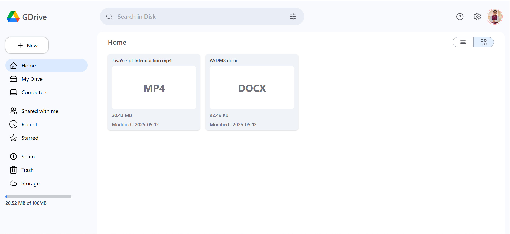
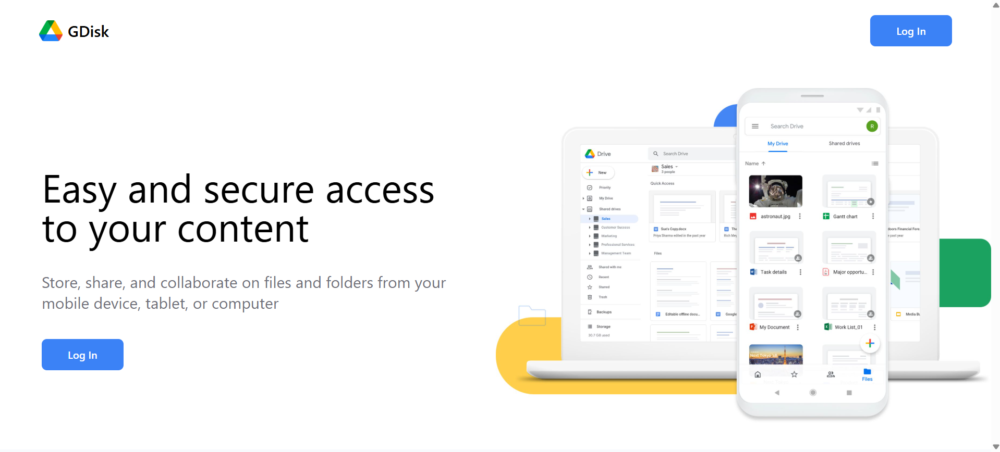
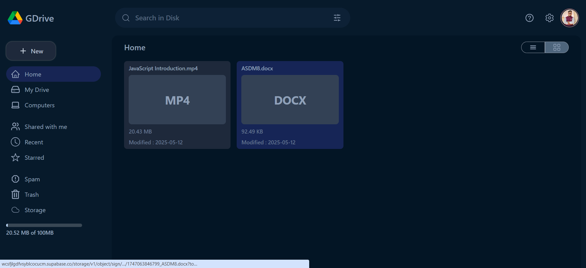

# 📁 GDrive Clone - Google Drive UI and File Manager

A fully functional Google Drive clone built using **React**, **Firebase**, and **Supabase**. Users can log in with Google, upload files to Supabase Storage, and manage them via a beautiful UI inspired by Google Drive.

## 🚀 Features

- 🔐 Google Authentication (Firebase)
- 📦 Upload files to Supabase Storage
- 📝 Store file metadata in Firestore
- 🌙 Light/Dark mode toggle
- 🔍 Real-time file search
- ⚠️ 1 GB storage limit enforcement
- 🎨 Responsive and clean UI (TailwindCSS)
- 🟢 Real-time file updates using `onSnapshot`

## 🔧 Tech Stack

| Technology     | Use Case                     |
|----------------|------------------------------|
| React          | UI and component logic       |
| Firebase       | Authentication & Firestore   |
| Supabase       | File Storage (S3-like)       |
| Tailwind CSS   | Styling                      |
| React Toastify | Notifications                |
| MUI            | Modal for file upload        |

## 📸 Screenshots

| Login Page | Dashboard | Dark Mode |
|------------|-----------|-----------|
|  |  |  |

## 🧠 How It Works

1. Users sign in via Google (Firebase Auth).
2. Uploaded files go to Supabase Storage.
3. File metadata (name, size, URL, timestamp) is stored in Firestore.
4. Files are fetched in real-time with `onSnapshot`.
5. Users can search files by name.

## 🛠️ Installation

```bash
git clone https://github.com/yourusername/gdrive-clone.git
cd gdrive-clone
npm install
npm run dev

⚠️ Make sure to add your Firebase and Supabase configuration in .env or a firebase.js and supabase.js file.

📁 Folder Structure
├── components/
│   ├── Header.jsx
│   ├── Sidebar.jsx
│   ├── Data.jsx
│   └── Login.jsx
├── Context/
│   └── AuthContext.jsx
├── App.jsx
├── MainApp.jsx
├── index.css
├── firebase.js
├── supabase.js

🙌 Acknowledgements
Firebase
Supabase
Tailwind CSS
React Icons
React Toastify
